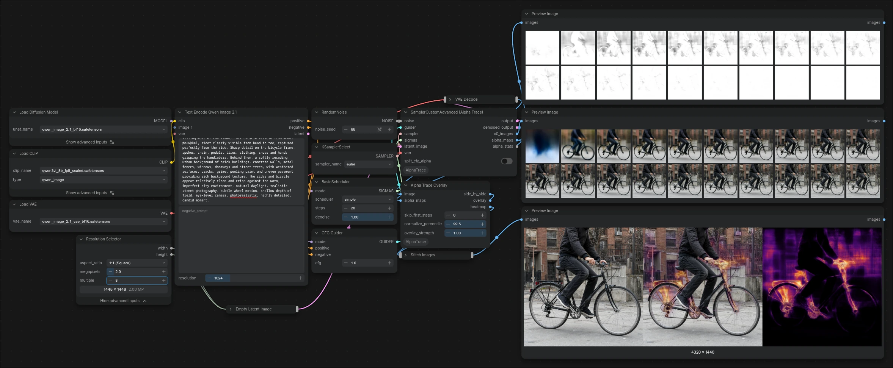

# ComfyUI-AlphaTrace

See what a diffusion model does at every step: the image it predicts and how its alpha channel evolves.

Built to investigate **Qwen Image 2.1**, which generates RGBA natively. The nodes only measure; they don't change generations.



## Install

```
cd ComfyUI/custom_nodes
git clone https://github.com/Nynxz/ComfyUI-AlphaTrace
```

Restart ComfyUI. No extra Python dependencies. The nodes are in the **alpha trace** category.

## Quick start

The example workflow shown above is included: in ComfyUI, open **Templates** and find **ComfyUI-AlphaTrace**, or load [`example_workflows/Qwen Image 2.1 Alpha Trace.json`](example_workflows/Qwen%20Image%202.1%20Alpha%20Trace.json).

To add a trace to your own workflow:

1. Replace your sampler with **SamplerCustomAdvanced (Alpha Trace)** or **KSampler (Alpha Trace)** and connect your VAE.
2. Connect `alpha_stats` to **Preview as Text** to see alpha per step.
3. For a heatmap, decode the output as usual and feed it with `alpha_maps` into **Alpha Trace Overlay**:

```
SamplerCustomAdvanced (Alpha Trace) ─ output ─→ VAE Decode ─→ image ─┐
                                    └ alpha_maps ────────────────────┴→ Alpha Trace Overlay ─ side_by_side → Preview Image
                                    └ alpha_stats → Preview as Text
```

For Qwen Image 2.1, use **LTXVScheduler** as `sigmas` to match the official schedule: `max_shift` 0.69, `base_shift` 0.54, `stretch` on, `terminal` 0.02, latent connected.

## Nodes

### KSampler (Alpha Trace) and SamplerCustomAdvanced (Alpha Trace)

Work exactly like KSampler and SamplerCustomAdvanced, with a `vae` input and these extra outputs:

| Output | Contents |
|---|---|
| `x0_images` | the predicted clean image at every step, decoded |
| `alpha_maps` | the alpha channel of each of those, as grayscale |
| `alpha_stats` | per step: sigma, min and mean alpha, share of pixels below 255, 250 and 128 |

`split_cfg_alpha` also reports the positive and negative predictions' alpha separately (two extra VAE decodes per step).

### Alpha Trace Overlay

Adds up how far each pixel's alpha fell short of opaque over the traced steps and draws it as a heatmap over an image. Outputs `side_by_side`, `overlay` and `heatmap`.

- `skip_first_steps` (default 1) leaves out step 0, a prediction from pure noise that would swamp the rest.
- `normalize_percentile` (default 99.5) sets which value shows as full intensity. Lower it if the map looks dark.

Judge detail against the plain image, not the overlay: the heat has a fine grid texture that makes overlaid areas look damaged when they aren't.

## Notes

- Traced runs are slower and use more memory: every step's prediction is kept and decoded after sampling. Only the first image in a batch is traced.
- Samplers that call the model more than once per step (`heun`, `dpmpp_2s`, …) get one row per call; the sigma column groups them.
- Works with any model whose VAE decodes alpha. With an RGB-only VAE, `alpha_stats` says there is no alpha channel.

## License

MIT
